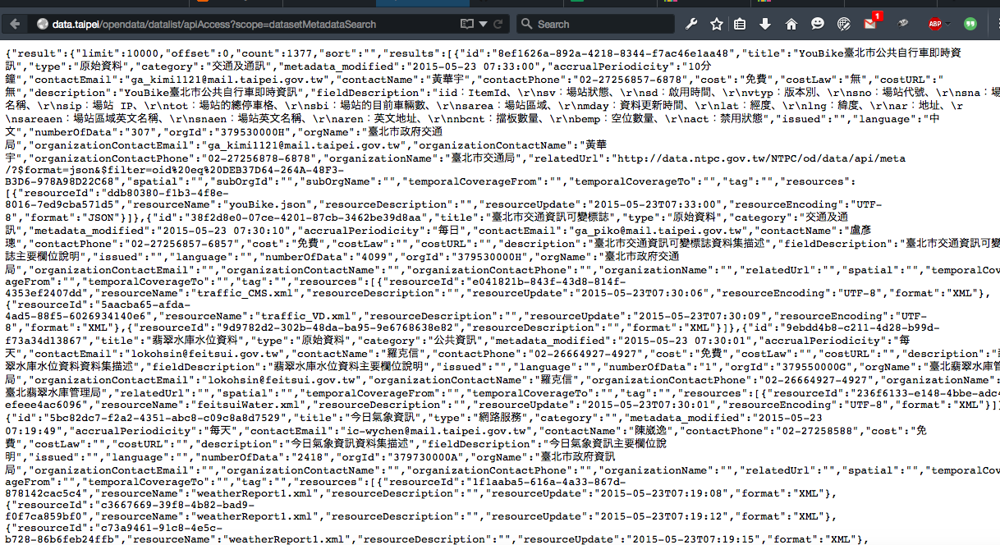
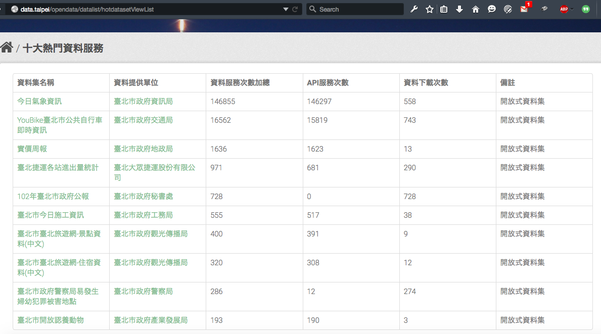
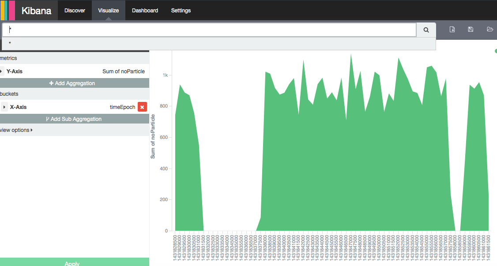

## Metadata Analyzer

所有資料集


---

## Metadata Analyzer

```{r, echo=FALSE}
library(jsonlite)
dataSetsMeta <- jsonlite::fromJSON("http://data.taipei/opendata/datalist/apiAccess?scope=datasetMetadataSearch&q=type:dataset")
dataSetsPubs <- jsonlite::fromJSON("http://data.taipei/opendata/datalist/apiAccess?scope=datasetMetadataSearch&q=type:publication")
#dataItem <- jsonlite::fromJSON("http://data.taipei/opendata/datalist/apiAccess?scope=resourceMetadataSearch")
head(dataSetsMeta$result$results$metadata_modified)
head(dataSetsPubs$result$results$metadata_modified)

library(dplyr)
dateMeta <- as.data.frame(as.Date(dataSetsMeta$result$results$metadata_modified))
datePubs <- as.data.frame(as.Date(dataSetsPubs$result$results$metadata_modified))
names(dateMeta) <- "Date"
names(datePubs) <- "Date"
str(dateMeta)
dateMeta <- summarize(group_by(dateMeta, Date), Num = n())
datePubs <- summarize(group_by(datePubs, Date), Num = n())
head(dateMeta)
library(ggplot2)
```

---

## Metadata Analyzer

```{r, warning=FALSE}
ggplot(data = dateMeta, aes(x = Date, y = Num)) + geom_line() + stat_smooth() + ggtitle("Dataset update")
```

---

## Metadata Analyzer

```{r, warning=FALSE}
ggplot(data = datePubs, aes(x = Date, y = Num)) + geom_line() + stat_smooth() + ggtitle("Publication update")
```

---

## Ooops



---

## Ooops


---

## hackbox

視覺化分析

