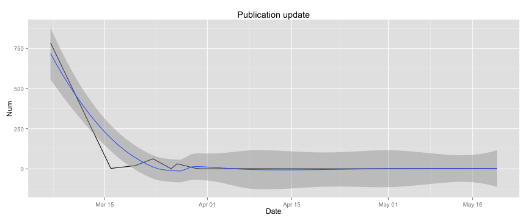
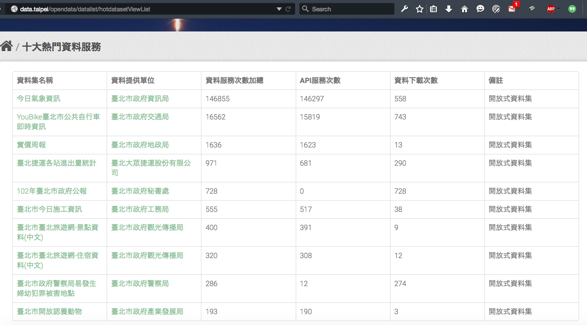
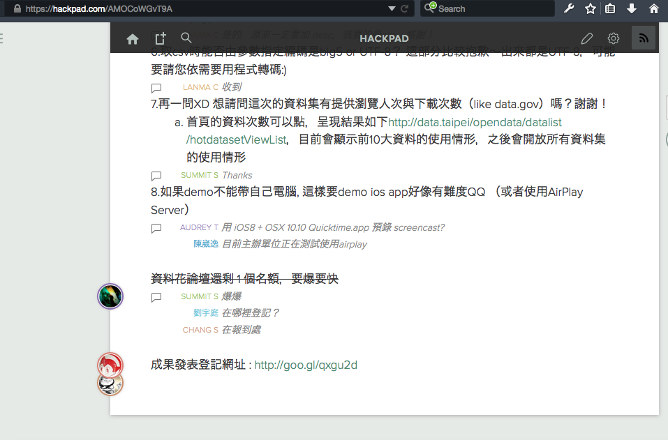

## Metadata Analyzer


---

## Metadata Analyzer


```
## [1] "2015-05-23 16:39:01" "2015-05-23 16:36:00" "2015-05-23 16:35:48"
## [4] "2015-05-23 16:35:23" "2015-05-23 16:35:11" "2015-05-23 16:34:00"
```

```
## [1] "2015-05-19 16:07:49" "2015-05-18 18:21:50" "2015-05-18 10:16:18"
## [4] "2015-05-18 10:13:33" "2015-05-14 16:55:31" "2015-05-14 16:14:08"
```

```
## 'data.frame':	456 obs. of  1 variable:
##  $ Date: Date, format: "2015-05-23" "2015-05-23" ...
```

```
## Source: local data frame [6 x 2]
## 
##         Date Num
## 1 2015-03-02   1
## 2 2015-03-06  43
## 3 2015-03-10  19
## 4 2015-03-11  11
## 5 2015-03-12  33
## 6 2015-03-13   5
```

---

## Metadata Analyzer


```r
ggplot(data = dateMeta, aes(x = Date, y = Num)) + geom_line() + stat_smooth() + ggtitle("Dataset update")
```

```
## geom_smooth: method="auto" and size of largest group is <1000, so using loess. Use 'method = x' to change the smoothing method.
```

 

---

## Metadata Analyzer


```r
ggplot(data = datePubs, aes(x = Date, y = Num)) + geom_line() + stat_smooth() + ggtitle("Publication update")
```

```
## geom_smooth: method="auto" and size of largest group is <1000, so using loess. Use 'method = x' to change the smoothing method.
```

 

---

## Ooops



---

## Ooops



---

## hackbox


